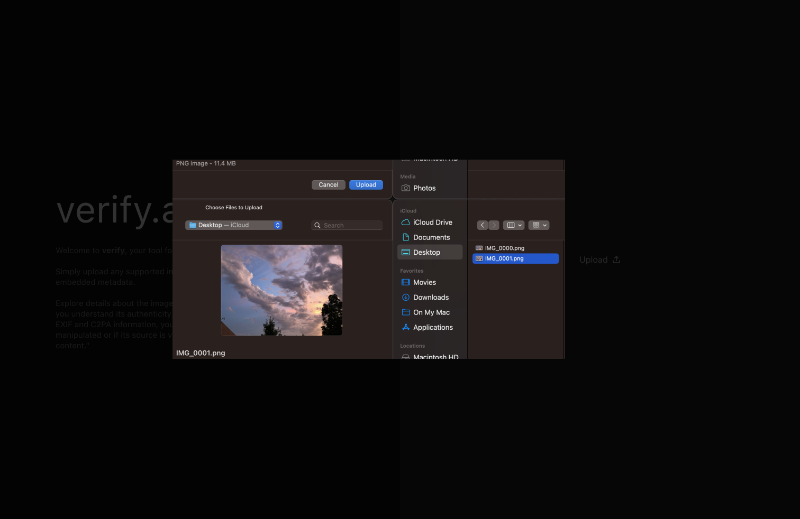

# isitai





isitai is a web application specializing in extracting and presenting encoded metadata from compressed rgb data files, also known as raster bitmap images.

the purpose of isitai is to allow users to inspect a given image's metadata such as the device model, modification dates, gps coordinates, profile creator, and rendering intent.  this information is crucial for understanding the context and authenticity of an image, especially in an era where ai-generated content is becoming increasingly prevalent.

verify ai, specifically extracts exif metadata and cryptographically secure c2pa information — from conventional image file formats including jpeg, png, jpg, heic, & webp. 

by democratizing data accessiblity, isitai gives users the tool to adequately identify whether a digital asset was captured by a human or generated by an artifically intelligent agent.

in the world of synthetic media and ai generated content, the authenticity of digital assets is paramount.  as the lines between human-created and machine-generated content blur, understanding the provenance of an image becomes crucial.  isitai aims to provide users with a comprehensive tool to analyze and verify the metadata embedded within images, ensuring transparency and trust in the digital landscape.

`dc-008-2024` `exif` version 3.0

`exif`, `c2pa`, `xmp`, `iptc-iim`

<details><summary>click here to view user interface</summary>


</details>

###  introduction

**about**  web application that views image encoded metadata, specifically exif and c2pa metadata.

[**`exif`**](https://www.cipa.jp/std/documents/download_e.html?cipa_dc-008-2024-e) - exchangable image file format, standard metadata embedded in image files (e.g. camera info, geolocation, timestamp).  the camera & imaging products association (cipa) and japan electronics and information and technology industries association (jeita) jointly formulated this standard.  the both standards are technically equivalent.

[cipa: - dc-008-2023 - exchangeable image file format for digital still cameras: exif version 3.0](https://www.cipa.jp/e/std/std-sec.html)

[jieta - cp-3451f - exchangeable image file format for digital still cameras: exif version 3.0](https://www.jeita.or.jp/cgi-bin/standard_e/list.cgi?cateid=1&subcateid=4)

[about exif 3.0](https://www.cipa.jp/std/documents/e/exif3.0-overview_e.pdf)

[exifinterface class by microsoft](https://learn.microsoft.com/en-us/dotnet/api/android.media.exifinterface?view=net-android-35.0)

[**`c2pa`**](https://opensource.contentauthenticity.org/docs/c2patool/docs/usage)  content authenticity initiative, a newer standard that embeeds content provenance metadata using cryptographically verifiable manifest

[guidelines for handling image metadata](https://s3.amazonaws.com/software.tagthatphoto.com/docs/mwg_guidance.pdf)

[xpm standard from adobe](https://www.adobe.com/devnet/xmp.html)

[xmp standard from iso](https://www.iso.org/standard/75163.html) - iso 16684-1:2019 - graphic technology — extensible metadata platform (xmp)

[xmp toolkit sdk](https://github.com/adobe/xmp-toolkit-sdk/tree/main)

[xmp toolkit programmers guide](https://github.com/adobe/xmp-toolkit-sdk/blob/main/docs/xmpprogrammersguide.pdf)

**tech stack typescript web stack**

**frontend** will contain next.js + chakra ui

**backend** node.js or serverless functions to handle processing server side

|  layer  |  title  |  description |
|:--------|:--------|:-------------|
|  frontend | `next.js`  |  react framework for server side rendering and static site generation |
|  frontend | `chakra ui`  |  component library for react with a focus on accessibility and theming |
|  backend | `node.js`  |  javascript runtime for server side processing |
|  backend | `serverless functions`  |  serverless functions for processing images and metadata |

```
exiftool version number         : 13.25
file name                       : img_0001.png
directory                       : .
file size                       : 11 mb
file modification date/time     : 2025:05:10 21:14:04-05:00
file access date/time           : 2025:05:14 16:22:21-05:00
file inode change date/time     : 2025:05:14 15:23:36-05:00
file permissions                : -rw-r--r--
file type                       : png
file type extension             : png
mime type                       : image/png
image width                     : 4032
image height                    : 3024
bit depth                       : 8
color type                      : rgb
compression                     : deflate/inflate
filter                          : adaptive
interlace                       : noninterlaced
profile name                    : icc profile
profile cmm type                : apple computer inc.
profile version                 : 4.0.0
profile class                   : input device profile
color space data                : rgb
profile connection space        : xyz
profile date time               : 2016:01:01 00:00:00
profile file signature          : acsp
primary platform                : apple computer inc.
cmm flags                       : not embedded, independent
device manufacturer             : apple computer inc.
device model                    :
device attributes               : reflective, glossy, positive, color
rendering intent                : perceptual
connection space illuminant     : 0.9642 1 0.82491
profile creator                 : apple computer inc.
profile id                      : 09a72bcf796cf3543b61a77f1ae38acc
profile description             : apple wide color sharing profile
profile copyright               : copyright apple inc., 2016
media white point               : 0.9642 1 0.8251


a to b2                         : (binary data 29772 bytes, use -b option to extract)
chromatic adaptation            : 1.04781 0.02289 -0.05017 0.02953 0.99051 -0.01706 -0.00925 0.01506 0.75191
a to b0                         : (binary data 29772 bytes, use -b option to extract)
a to b1                         : (binary data 29772 bytes, use -b option to extract)
exif byte order                 : big-endian (motorola, mm)
make                            : apple
camera model name               : iphone x
orientation                     : horizontal (normal)
x resolution                    : 72
y resolution                    : 72
resolution unit                 : inches
software                        : 11.4
modify date                     : 2018:07:19 21:04:54
tile width                      : 512
tile length                     : 512
exposure time                   : 1/24
f number                        : 1.8
exposure program                : program ae
iso                             : 40
exif version                    : 0221
date/time original              : 2018:07:19 21:04:54
create date                     : 2018:07:19 21:04:54
offset time                     : -05:00
offset time original            : -05:00
offset time digitized           : -05:00
components configuration        : y, cb, cr, -
shutter speed value             : 1/24
aperture value                  : 1.8
brightness value                : 3.138169257
exposure compensation           : -0.173
metering mode                   : spot
focal length                    : 4.0 mm
subject area                    : 2820 2094 755 753
maker note version              : 9
run time flags                  : valid
run time value                  : 122533112040916
run time scale                  : 1000000000
run time epoch                  : 0
ae stable                       : yes
ae target                       : 182
ae average                      : 179
af stable                       : yes
acceleration vector             : -0.8960353732 -0.07537551967 0.4357159734
focus distance range            : 26.33 - 27.22 m
ois mode                        : 2
content identifier              : 1b0e4499-bb39-414b-a2af-447d4e8538b6
image capture type              : unknown (5)
live photo video index          : 8192
photos app feature flags        : 0
sub sec time                    : 181
sub sec time original           : 181
sub sec time digitized          : 181
flashpix version                : 0100
exif image width                : 4032
exif image height               : 3024
sensing method                  : one-chip color area
scene type                      : directly photographed
exposure mode                   : auto
white balance                   : auto
digital zoom ratio              : 1.292307692
focal length in 35mm format     : 36 mm
scene capture type              : standard
lens info                       : 4-6mm f/1.8-2.4
lens make                       : apple
lens model                      : iphone x back dual camera 4mm f/1.8
gps altitude ref                : above sea level
gps time stamp                  : 02:04:54
gps speed ref                   : km/h
gps speed                       : 0
gps img direction ref           : true north
gps img direction               : 262.6861314
gps dest bearing ref            : true north
gps dest bearing                : 262.6861314
gps date stamp                  : 2018:07:20
gps horizontal positioning error: 5 m
pixels per unit x               : 2835
pixels per unit y               : 2835
pixel units                     : meters
xmp toolkit                     : xmp core 6.0.0
color space                     : uncalibrated
flash pix version               : 0100
subsec time original            : 181
subsec time digitized           : 181
flash function                  : false
flash fired                     : false
flash return                    : no return detection
flash mode                      : auto
flash red eye mode              : false
focal len in 35mm film          : 36
subsec time                     : 181
creator tool                    : 11.4
photographic sensitivity        : 40
subject                         :
date created                    : 2018:07:19 21:04:54-05:00
run time since power up         : 1 days 10:02:13
aperture                        : 1.8
image size                      : 4032x3024
megapixels                      : 12.2
scale factor to 35 mm equivalent: 9.0
shutter speed                   : 1/24
create date                     : 2018:07:19 21:04:54.181-05:00
date/time original              : 2018:07:19 21:04:54.181-05:00
modify date                     : 2018:07:19 21:04:54.181-05:00
gps altitude                    : 398.3 m above sea level
gps date/time                   : 2018:07:20 02:04:54z
gps latitude                    : 37 deg 41' 44.00" n
gps longitude                   : 97 deg 21' 21.99" w
flash                           : auto, did not fire
gps latitude ref                : north
gps longitude ref               : west
circle of confusion             : 0.003 mm
field of view                   : 53.1 deg
focal length                    : 4.0 mm (35 mm equivalent: 36.0 mm)
gps position                    : 37 deg 41' 44.00" n, 97 deg 21' 21.99" w
hyperfocal distance             : 2.66 m
light value                     : 7.6
lens id                         : iphone x back dual camera 4mm f/1.8

```


###  goals

1.  allow users to easily upload images
2.  clearly present extracted `exif` metadata
3.  clearly present extracted `c2pa` metadata, authenticity, and provenance info
4.  user friendly and accessible interface
5.  efficient and secure processing of images

###  functional requirements

####  fr1

1.  upload image file using drag and drop interface
2.  upload an image file by clicking an upload button and selecting a file from their local system
3.  support at least some of the following image formats `jpeg`, `png`, `heic`, `webp`
4.  visual feedback during upload process (e.g. progress indicator)
5.  display an error message if the uploaded file is not a supported image type or exceeds a size limit
6.  maximym file size is defined as 25mb
7.  application show allow replacing the current image with a new one or clearing the current image and metadata view

####  fr2

1.  backend shall extract `exif` metadata from the uploaded image
2.  frontend shall display common `exif` tags in a structured and human readable format

|  catagory  |   exif tag |
|:----------|:-------------|
| file information | `file name`, `file size`, `file type`, `mime type` | 
| image characteristics | `image width`, `image height`, `bit depth`, `color type`, `color space`, `profile name` |
|  camera information | `make`, `camera model name`, `software`, `orientation` |
| exposure details | `exposure time`, `f numbers`, `exposure program`, `iso`, `shutter speed value`, `aperture` |
| lens information | `focal length` | 

####  fr3

####  fr4


names for this project domain names

verify-ai.net

check4ai.com

isitai.net
